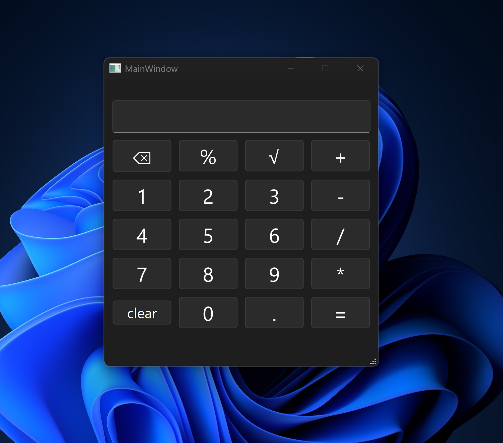

# Calculator Application

A desktop graphical user interface  calculator application built with PySide6 
and Python using object-oriented programming principles. 
The project separates interface from calculation logic for a more modular architecture.

## Purpose

This project was created to practice:

- Object-oriented programming
- GUI development with PySide6
- Qt Designer integration
- Event-driven programming
- Separation of concerns in application design

## Features

- Basic arithmetic operations (`+`, `-`, `*`, `/`)
- Modulo (`%`) and square root (`√`) support
- Decimal number input
- Clear (`C`) and backspace (`X`) controls
- Event-driven GUI using PySide6 signals and slots
- Qt Designer integration through `.ui` files
- Modular architecture separating UI and logic
- String-based expression parsing and evaluation

## Project Structure

```text
calculator/
│
├── calculator.py
├── README.md
│
├── gui/
│   ├── __init__.py
│   ├── mainwindow.py
│   ├── ui_mainwindow.py
│   └── ui_calculator.ui
│
├── images/
│   └── calculator.png
│
└── src/
    ├── __init__.py
    └── calc.py
```

## Usage

Run the application:

```bash
python calculator.py
```

## Architecture

- `gui/` — User interface layer built with PySide6
- `images/` — Application screenshot
- `src/` — Core calculation logic and expression handling
- `calculator.py` — Application entry point

## Logic

- Expression is built as a string. 
- Calculator evaluates full expression.
- UI sends button input, displays result.

## Requirements

- PySide6
- Python 3.10+

## Preview



## Installation

Clone the repository:

```bash
git clone <repo-url>
cd calculator
```

Install dependencies:

```bash
pip install PySide6
```