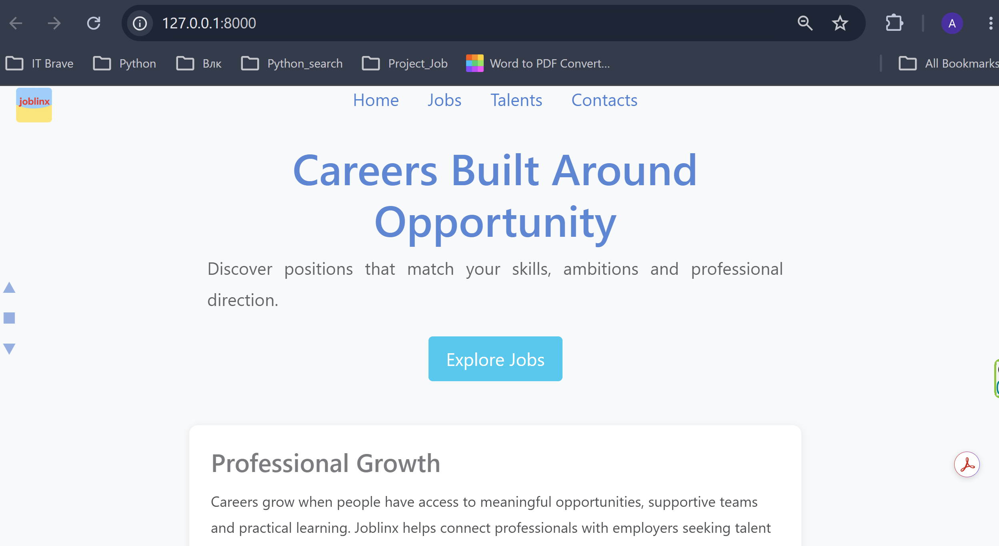
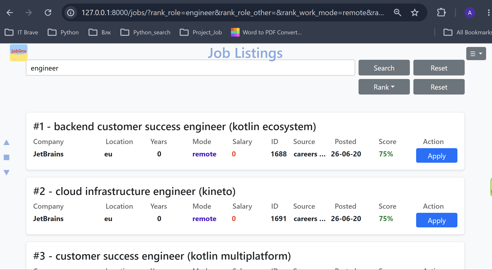
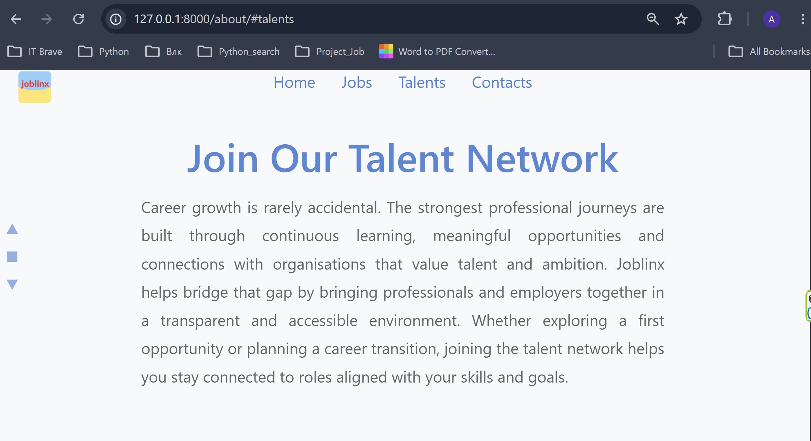
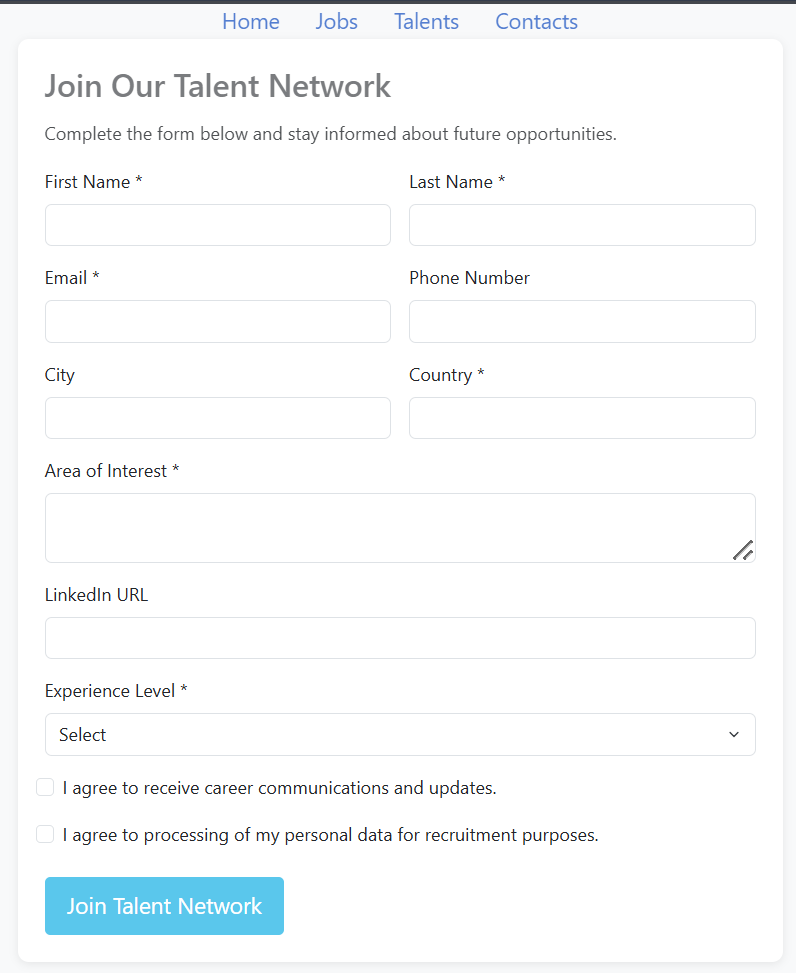
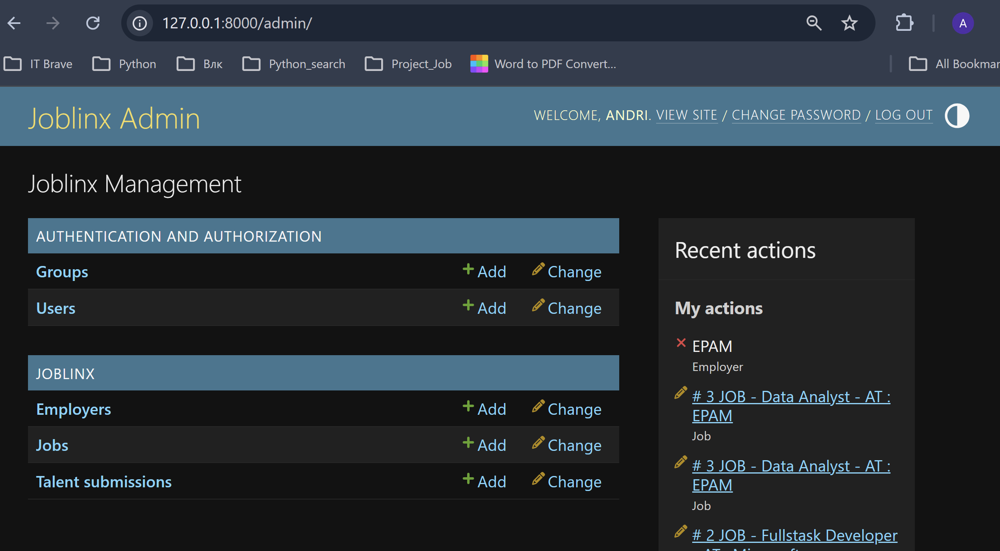
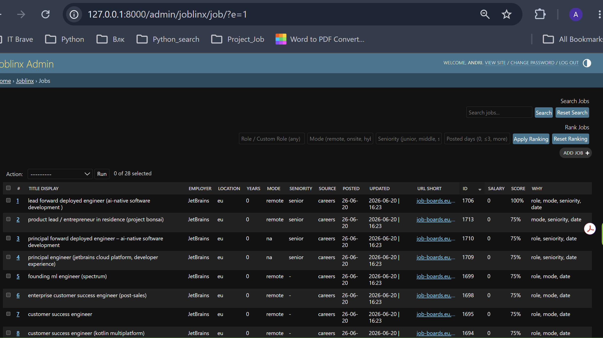
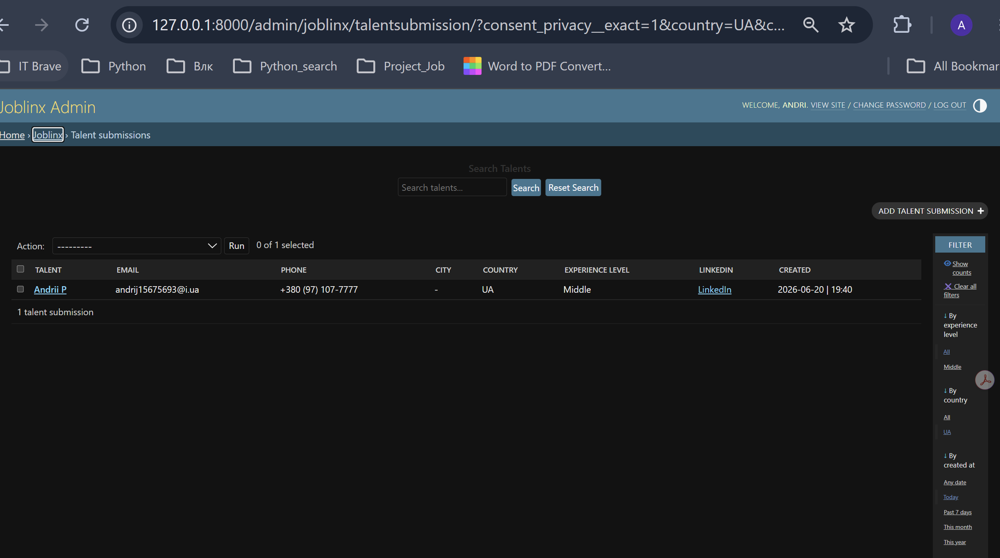
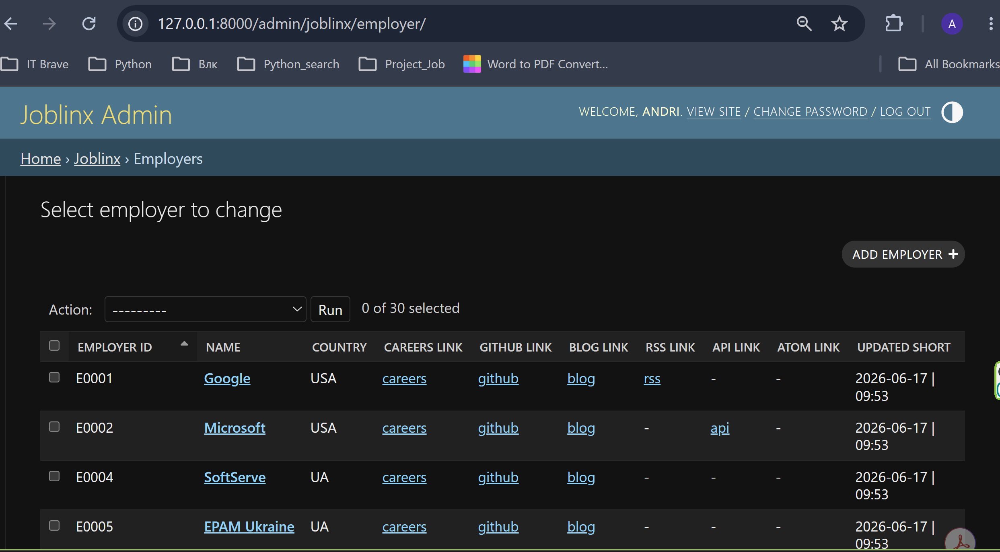

# 🚀 JobLinx

> **Smart Job Aggregation & Talent Matching Platform**
>
> JobLinx is a Django-based platform that aggregates job vacancies from multiple employer sources, ranks them according to user preferences, and helps manage talent submissions through a customized admin dashboard.

---

## ✨ Overview

JobLinx collects vacancies from employer-owned sources and presents them in a clean searchable interface.  
The project includes a public job listings UI, a talent submission page, and a customized Django Admin dashboard for managing jobs, employers, ranking, and talent data.

The platform focuses on:

- 🔎 Job search
- 📊 Job ranking
- 🏢 Employer source management
- 👥 Talent network submissions
- ⚙️ Automated vacancy fetching
- 🧠 Ranking explanation through the `Why` column

---

## 📸 Application Preview

### 🌐 Public Job Listings Interface







The public job listings page allows users to:

- Search vacancies by keyword
- Rank jobs by role, work mode, seniority, and posted date
- Reset search and ranking filters
- View job score
- Open the exact vacancy page through the Apply button
- Browse collected jobs in a clean card-based interface

---

### 🔐 Admin Job Dashboard







The admin dashboard allows the project owner to:

- Search jobs
- Rank jobs manually
- Reset ranking
- Review job scores
- See why a job was scored through the `Why` column
- Manage employers
- Manage talent submissions
- Review source status

---

## 🛠 Technology Stack

| Layer | Technology |
|---|---|
| Backend | Python, Django |
| Database | SQLite |
| Frontend | HTML, CSS, Bootstrap 5 |
| Admin Panel | Django Admin |
| Version Control | Git, Git Bash |

---

## ⭐ Key Features

### 🔄 Automated Job Collection

JobLinx can fetch job data from several employer source types:

- Careers pages
- RSS feeds
- Atom feeds
- APIs
- GitHub links
- Company blogs

The fetch pipeline supports:

- Basic HTML parsing
- RSS/XML parsing
- JSON/API parsing
- Job title normalization
- Duplicate detection
- Source status tracking
- Vacancy URL preservation

---

### 🎯 Smart Job Ranking

Jobs can be ranked by:

#### Role

Examples:

- Python
- Developer
- Engineer
- Analyst

#### Work Mode

- Remote
- Onsite
- Hybrid / Mixed
- N/A

#### Seniority

- Junior
- Middle
- Senior

#### Posted Date

- Today
- Last 3 days
- Older

The same ranking logic is used in:

- Public Jobs UI
- Django Admin Jobs Dashboard

---

### 🧠 Ranking Explanation

The admin dashboard includes a `Why` column.

It explains which ranking factors matched the current manual ranking filter, for example:

```text
role
mode
seniority
date
role, mode
role, mode, date
```

---

### 👥 Talent Network

Users can submit talent profiles through the public form.

Collected data includes:

- First name
- Last name
- Email
- Phone
- City
- Country
- Area of interest
- Experience level
- LinkedIn URL
- Communication consent
- Privacy consent

Talent submissions are managed in Django Admin.

---

## 🧩 Core Models

### Job

Stores job vacancy data:

```text
title
employer
years
seniority
location
mode
salary
url
source
posted_date
updated
is_active
idx
score
why
```

---

### Employer

Stores employer source links:

```text
name
country
careers_url
github_url
rss_url
api_url
blog_url
atom_url
updated
```

---

### TalentSubmission

Stores talent profile submissions:

```text
first_name
last_name
email
phone
city
country
area_of_interest
linkedin_url
experience_level
consent_communications
consent_privacy
created_at
```

---

### SourceState

Tracks source fetch state:

```text
employer
url
last_status
```

---

## 📂 Project Structure

```text
job_engine/
│
├── manage.py
│
├── job_engine/
│   ├── settings.py
│   ├── urls.py
│   ├── asgi.py
│   └── wsgi.py
│
├── joblinx/
│   │
│   ├── admin.py
│   ├── apps.py
│   ├── models.py
│   ├── views.py
│   ├── urls.py
│   ├── tasks.py
│   │
│   ├── services/
│   │   ├── fetch_layer.py
│   │   ├── ranking.py
│   │   ├── diff_engine.py
│   │   ├── normalizer.py
│   │   ├── signal_extractor.py
│   │   └── ...
│   │
│   ├── adapters/
│   │   ├── base.py
│   │   ├── api.py
│   │   └── rss.py
│   │
│   ├── management/
│   │   └── commands/
│   │       └── test_fetch.py
│   │
│   ├── migrations/
│   │
│   └── templates/
│       ├── jobs.html
│       ├── about.html
│       └── admin/
│           ├── job_change_list.html
│           └── talent_change_list.html
│
├── static/
│   ├── css/
│   │   └── style_0706.css
│   │
│   ├── admin/
│   │   └── css/
│   │       └── talent_admin.css
│   │
│   └── image/
│       ├── joblinx.png
│       ├── joblinx_black.png
│       ├── joblistings_ui.png
│       ├── joblistings_ui.png
│       ├── joblistings_ui.png
│       ├── joblistings_ui.png
│       ├── joblistings_ui.png
│       ├── admin_main_dashboard.png
│       ├── admin_jobs_dashboard.png
│       ├── admin_talents_dashboard.png
│       └── admin_employers_dashboard.png
│
├── db.sqlite3
│
└── README.md
```

---

## 🚀 Installation

### 1. Clone the repository

```bash
git clone <repository-url>
cd job_engine
```

---

### 2. Create a virtual environment

```bash
python -m venv venv
```

---

### 3. Activate the virtual environment

#### Windows

```bash
venv\Scripts\activate
```

#### Git Bash

```bash
source venv/Scripts/activate
```

---

### 4. Install dependencies

```bash
pip install -r requirements.txt
```

---

### 5. Apply migrations

```bash
python manage.py migrate
```

---

### 6. Run the development server

```bash
python manage.py runserver
```

Open:

```text
http://127.0.0.1:8000/
```

---

## 🔐 Admin Access

Admin dashboard:

```text
http://127.0.0.1:8000/admin/
```

Admin features:

- Manage jobs
- Manage employers
- Manage talent submissions
- Search jobs
- Rank jobs
- Reset ranking
- Review job score
- Review ranking explanation
- Check source states

---

## 🔎 Job Fetching

To run a fetch cycle manually:

```bash
python manage.py test_fetch
```

The fetch cycle:

1. Reads employer source URLs
2. Requests supported source pages
3. Parses RSS/XML, JSON, or HTML
4. Normalizes vacancy titles
5. Saves clean jobs
6. Preserves real vacancy URLs
7. Updates source state

---

## 📊 Ranking Logic

Each ranking factor may contribute to the job score.

Supported ranking factors:

```text
role
mode
seniority
posted date
```

The dashboard also stores a readable explanation in the `why` field.

Example:

```text
Score: 75%
Why: role, mode, date
```

---

## 🧪 Useful Commands

### Create migrations

```bash
python manage.py makemigrations
```

### Apply migrations

```bash
python manage.py migrate
```

### Check migration state

```bash
python manage.py showmigrations joblinx
```

### Check for model changes

```bash
python manage.py makemigrations --check
```

### Run server

```bash
python manage.py runserver
```

---

## 📈 Future Roadmap

Planned improvements:

- 📧 Email job alerts
- 📲 Telegram job alerts
- 🤖 Improved talent-to-job matching
- 📄 Resume upload support
- 🔌 REST API
- ⏰ Scheduled job notifications
- 🐳 Docker deployment
- ☁️ Cloud deployment

---

## 👨‍💻 Author

**Andrii Panchenko**

Python Developer | Django Developer

---

## 📄 License

Educational / Portfolio Project
